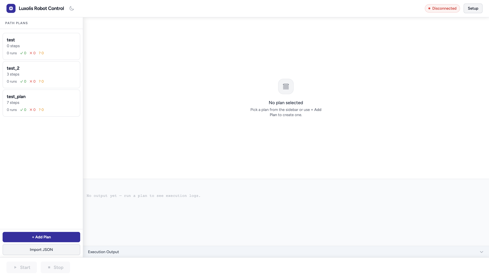

# Robot Control UI

| Light mode | Dark mode |
|---|---|
|  |  |

Web UI control panel for a Doosan a0912 robot arm. Load a plan, connect, run. Hand teaching is also supported, such as record positions live and build plans directly from the arm.

## Prerequisites

- Ubuntu 22.04 (Jammy)
- [ROS 2 Humble Desktop](https://docs.ros.org/en/humble/Installation.html)
- [doosan-robot2](https://github.com/DoosanRobotics/doosan-robot2), official Doosan ROS 2 package
- Luxolis-specific setup: [doosan-robot-guides](https://github.com/Luxolis-AI/doosan-robot-guides), see `DOOSAN_ROBOT_GUIDE.md`

## Running

```bash
python3 -m venv .venv
.venv/bin/pip install -r requirements.txt
.venv/bin/python3 server.py
```

Open `http://localhost:8000`. Needs internet access for CDN scripts.

## How it works

- `server.py` is the whole backend. using FastAPI + WebSocket, no database
- Plans are JSON files in `plans/`, run history in `stats/`
- Frontend is Alpine.js + Tailwind via CDN, no build step
- Running a plan spawns `move_joint_node` as a subprocess and streams its stdout to the terminal panel
- The UI reads sentinel strings (`[CONNECTED]`, `[DONE]`, `[ERROR]`) from that stream to update state, no polling needed
- Robot control (movement execution, hand teaching, position capture) goes through `ros2 service call` to the Doosan ROS 2 services running on the robot

## Hand teaching

- Open a plan (edit) or add a new plan, inside the steps popup, switch to Hand Guide tab, enable hand guide mode
- Move the arm to a position and press Record. The point shows up in the step list
- Steps are draggable to reorder, select a step and press Record to update just that position
- Switching a step between MoveJ and MoveL resets the position values (joint angles and Cartesian coordinates are not interchangeable)

## Architecture

**Single-file backend.** `server.py` has no internal modules. The app is small enough that splitting it would just add file-hopping without making anything clearer.

**Sentinel strings, not polling.** The terminal stream already carries every state transition, so one WebSocket connection handles both terminal output and UI state. Using a separate polling loop would be redundant.

**Flat JSON files.** with no database because plans are small, writes are infrequent, and being able to open and edit a plan file directly is useful.

**No bundler.** The UI is one Alpine component. A build pipeline would cost more in setup and maintenance than it saves.
