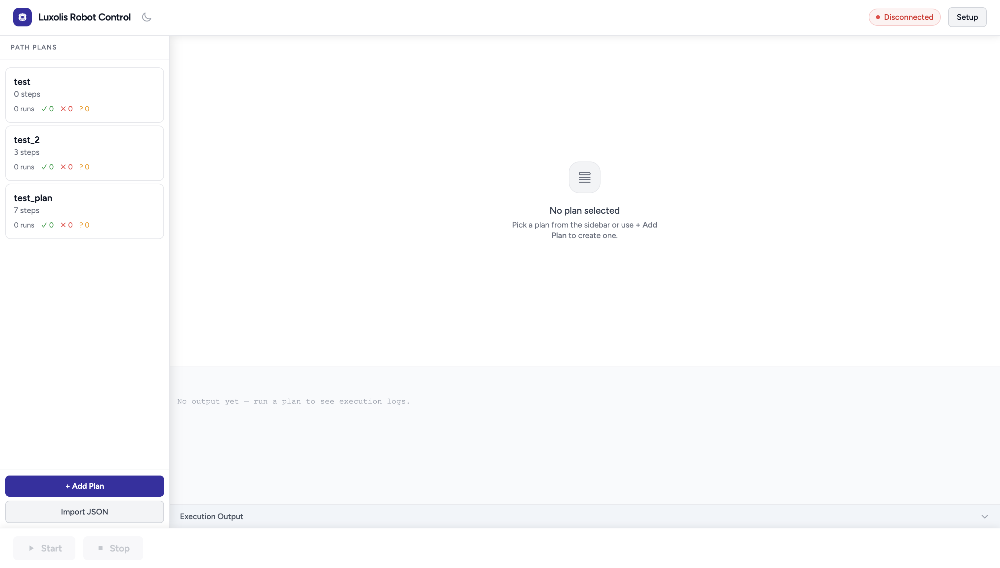
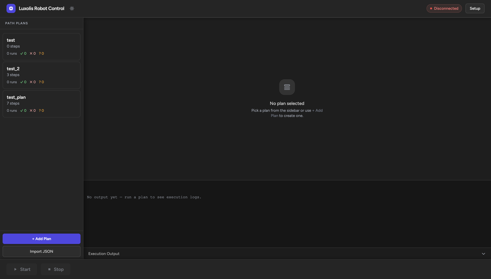

# Robot Control UI

| Light mode | Dark mode |
|---|---|
|  |  |

Web UI control panel for a Doosan a0912 robot arm with an Arduino-driven turntable and laser. Load a plan, connect, run. Plans mix robot moves (`MoveJ`/`MoveL`/`MoveC`/`WeldStraight`) with turntable and laser steps, sequential or parallel. Hand teaching is also supported: record positions live and build plans directly from the arm.

## Prerequisites

- Ubuntu 22.04 (Jammy)
- [ROS 2 Humble Desktop](https://docs.ros.org/en/humble/Installation.html)
- [doosan-robot2](https://github.com/DoosanRobotics/doosan-robot2), official Doosan ROS 2 package
- Luxolis-specific setup: [doosan-robot-guides](https://github.com/Luxolis-AI/doosan-robot-guides), see `docs/DOOSAN_ROBOT_GUIDE.md`
- Arduino running `arduino_test01.ino` for turntable/laser/emergency-stop (optional, only needed for those features)

### Flashing the Arduino

- Board: Uno/Nano or similar, needs an external-interrupt pin on D2 for the emergency-stop button
- Wiring: D8 laser relay, D10/D11/D12 to DM542A PUL/ENA/DIR, D2 to the emergency-stop button (pulled up, switch to GND)
- No extra libraries needed

**Arduino IDE:** open `arduino_test01.ino`, select the board and port under Tools, then Upload.

**arduino-cli:**

```bash
arduino-cli compile --fqbn arduino:avr:uno arduino_test01.ino
arduino-cli upload -p /dev/ttyACM0 --fqbn arduino:avr:uno arduino_test01.ino
```

Swap `arduino:avr:uno` for `arduino:avr:nano` (or your board's FQBN) and `/dev/ttyACM0` for the detected port (`arduino-cli board list`).

Once flashed, the server auto-detects the board over USB (see `docs/architecture.md` §6).

## Running

```bash
python3 -m venv .venv
.venv/bin/pip install -r requirements.txt
.venv/bin/python3 server.py
```

Open `http://localhost:8000`. Needs internet access for CDN scripts.

For a packaged client deployment (Docker, including Jetson/ARM64), see `docs/deployment.md`.

## How it works

- `server.py` is the whole backend, using FastAPI + WebSocket, no database
- Plans are JSON files in `plans/`, run history in `stats/`
- Frontend is Alpine.js + Tailwind via CDN, no build step
- Running a plan spawns `move_joint_node` as a subprocess. It runs every step in the plan, including turntable/laser steps, which it just hands back to the server via a `[WAIT]`/`RESUME` handshake while the server drives the Arduino directly
- The UI reads sentinel strings (`[CONNECTED]`, `[DONE]`, `[ERROR]`, `[STEP_START]`, `[WAIT]`, `[EMERGENCY STOP]`, ...) from the `/ws/terminal` stream to update state, no polling needed
- Robot control (movement execution, hand teaching, position capture) goes through `ros2 service call` to the Doosan ROS 2 services running on the robot
- Turntable, laser, and the emergency-stop button are all on one Arduino over serial; an emergency stop disables turntable/laser instantly and quick-stops the robot

For the full picture, including the step-by-step protocol between the server, `move_joint_node`, and the Arduino, see `docs/architecture.md`. For every API endpoint and feature, see `docs/servers_functions_features.md`.

## Hand teaching

- Open a plan (edit) or add a new plan, inside the steps popup, switch to Hand Guide tab, enable hand guide mode
- Move the arm to a position and press Record. The point shows up in the step list
- Steps are draggable to reorder, select a step and press Record to update just that position
- Switching a step between MoveJ and MoveL resets the position values (joint angles and Cartesian coordinates are not interchangeable)
- For `WeldStraight` and `MoveC` steps, use the Capture buttons to grab the robot's current pose into `pos_a`/`pos_b`/`pos_start`/`pos_via`/`pos_end` without recording a full waypoint

## Architecture

**Single-file backend.** `server.py` has no internal modules. The app is small enough that splitting it would just add file-hopping without making anything clearer.

**Sentinel strings, not polling.** The terminal stream already carries every state transition, so one WebSocket connection handles both terminal output and UI state. Using a separate polling loop would be redundant.

**Flat JSON files.** with no database because plans are small, writes are infrequent, and being able to open and edit a plan file directly is useful.

**No bundler.** The UI is one Alpine component. A build pipeline would cost more in setup and maintenance than it saves.

For the bigger architectural decisions (why ROS2, why Ubuntu, why a web app instead of a Python GUI, Jetson hardware constraints), see `docs/architecture_decisions.md`.
